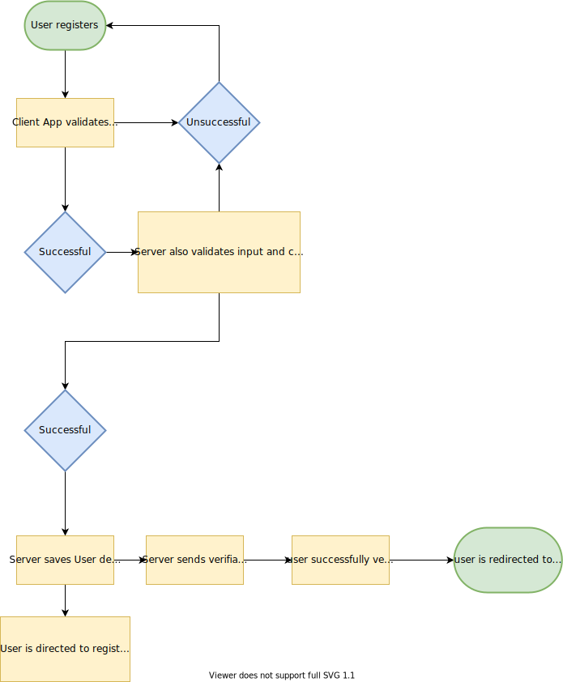

# Gym Time

Gym Time is a full stack application that has a sign-up page that includes the process of verifing their account by clicking on a link in their email.

## Installation

### Prerequisites

- Node
- MongoDB

1. Clone this repository

2. Install server dependencies

```
cd server
npm install
```

3. Install client dependencies

```
cd client
npm install
```

## Run the app

1. Start mongodb locally

```
$ mongod
```

2. Start the server

```
$ cd server
$ npm start
```

3. Start the client

```
$ cd client
$ npm start
```

## Testing

### Server

Make sure mongodb is running before testing

```
cd server
npm test
```

### Client

```
cd client
npm test
```

## Tech stack

### Client

- React / TypeScript / Material UI

### Server

- Node / GraphQL / TypeGraphQL / TypeScript / Express / MongoDB / Mongoose / Typegoose

### Tooling / Other Tech Worth Mentioning

- Lodash / Argon2 / GraphQL Code Generator



## Comments

- I think implementing input validation on both client and server sides provides the best outcome. On the client side, we can reduce unncessary server requests and get faster response times on providing feedback to the user. I like to think that the server side validation is even more important as it sits closer to the database and ensures data consistency before entering the database. New client apps can be built with no input validation, increasing the benefit of server side valiation as an extra layer of security.
- The input requirements implemented in this project are loose, e.g. full names only have a basic max character restriction. Further restrictions could be disallowing number characters. The validation implementation was focused on demonstrating how the validation logic is architectured.
- Sanitizing the register input was also an implemented feature, primarily removing unncessary white spaces
- I thought about whether it was a good idea to lowercase all emails and full names before saving to the database to ensure data consistency, but upon researching - I decided not to. As a user, if I liked to spell my email in all uppercase, it should be reflected in the saved data. This makes sense, so I opted for this. However, I also think there's no 100% right answer, and this stems down to the specific use case

### Potential Improvements

- There is code duplication regarding the validation logic done on both client and server side. Ideally, the code and logic could be architectured to be stored into a centralized place to adhere to _DRY_ principles
